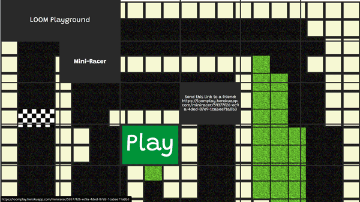
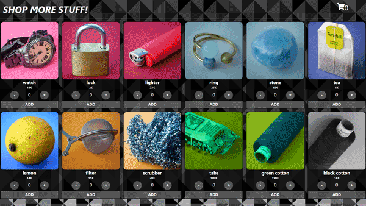
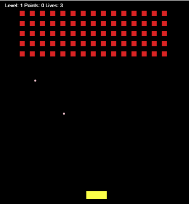

# More TypeScript!

## Learning and getting used to TypeScript!

In my future projects I will only use TypeScript! I have been convinced!

## Content:

### multiplayer:

-   Visit the website and try it out: https://loomplay.herokuapp.com/
-   #### Tech Stack:
    -   React
    -   Node.js
    -   Socket.io
-   #### About:
    Finally I have started to build a multiplayer-website. You send the given link to a friend. This link
    connects both players to a private Gaming-Room. Only Two-Player-Games ( for the moment ).
    First game: Mini-Racer game. The signaling is handled by socket.io.
    Styling and more features are coming soon!
-   #### Preview:
    

### ecommerce:

-   See the little Webshop-Website on Github pages: https://lpf33.github.io/littlewebshop/
-   #### Tech Stack:
    -   React
    -   Context API
-   #### About:
    Just a side project. Making a little, simple Webshop. State Mangement with React Context.
    Shop, order overview, delivery and billing address, paying method, order confirmation.
-   #### Preview:
    

### space_invaders:

-   Play the game on https://larspefe.herokuapp.com/Games
-   Classical shoot'em up game. Great way to implement all the features of a programming language.
-   ### Preview:
    

### notes:

-   Little CRUD-APP to make notes.
-   Tech Stack: Express, React, PostgreSQL

### little side projects:

-   #### csvAnalyze : Reading with fs-Node-module a csv.file and analyze it.
-   #### pokedex : fetch data from poke.api and read it.
-   #### sortAlgorithmen: Using classes and bubbleSort-Algorithmen to sort number-Arrays, string-Arrays and linked Lists.
-   #### starwars: React-App, fetch StarWars-Data and use useQuery-Hook / usePaginatedQuery-Hook.
-   #### usermaps: Set markers to specified coordinates on a Mapbox-Map with Faker-npm-package for some random fake users/companies.
